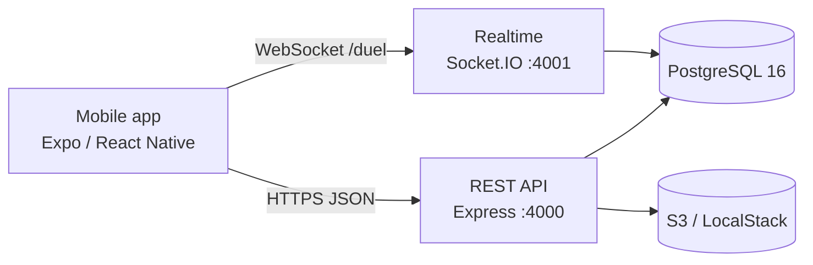

# Platyko


**Platyko** is a mobile app for deliberate daily JavaScript practice. Developers at Junior, Mid, or Senior level follow a structured curriculum, keep a daily streak, and battle each other in real-time 1v1 duels.

The core loop: **learn → streak → duel.**

This repository is an npm-workspaces monorepo containing the Expo/React Native mobile app, an Express REST API, a Socket.IO real-time service for duels, and a set of shared TypeScript packages (database client, JWT helpers, game constants, and pure domain logic) that keep all three runtimes in sync.

## Features

- **Onboarding wizard** — 3-step level / goal / commitment picker on first launch (AsyncStorage-gated).
- **Learn** — 3 curriculum blocks per level (9 total), each with 10 exercises mixing multiple-choice and short-answer puzzle types. Progress is server-synced for registered users and stored locally for guests.
- **Duel Mode** — real-time 1v1 Socket.IO battles over 5 rounds, for authenticated users only. Solo auto-match kicks in after 25 s with no opponent; each round allows up to 3 wrong attempts. Includes post-match replay and rematch.
- **Code Puzzle** — standalone free-response puzzles evaluated against accepted answers or test cases inside an `isolated-vm` V8 sandbox (32 MB / 100 ms limits). XP is capped at 10 solves per puzzle.
- **XP & Level** — 250 XP per correct answer across lessons, puzzles, and duel rounds; `level = floor(xp / 250) + 1`.
- **Streak** — increments once per calendar day on qualifying XP, resets after 2+ missed days. The same pure logic runs on backend, io, and mobile.
- **Daily Goal** — a user-chosen commitment (10 / 15 / 25 min) with server-side practice-time tracking and a daily push notification at 19:00 via `expo-notifications`.
- **Accounts & auth** — email + password registration with OTP email verification (AWS SES), Google Sign-In, JWT access/refresh tokens, password change, and account deletion.
- **Profile** — avatar upload to S3, username, and preference management.
- **Guest mode** — full Learn and Code Puzzle access without an account; XP and streak are kept locally. Registering unlocks Duel Mode and server sync.

## Tech Stack

| Layer | Path | Technology |
|-------|------|------------|
| Mobile app | `mobile/` | React Native 0.81, Expo 54, Redux Toolkit, React Navigation 7 |
| HTTP API | `backend/` | Express 5, Prisma 6, Zod, JWT (HS256), `isolated-vm` |
| Real-time | `io/` | Socket.IO 4 — `/duel` namespace |
| Database | `packages/db/` | PostgreSQL 16, Prisma multi-file schema, singleton client |
| Shared logic | `packages/*` | `auth-jwt`, `xp-constants`, `streak-logic`, `duel-constants`, `exercise-answer`, `user-credentials`, `server-kit` |
| Storage | AWS S3 (LocalStack locally) | Avatar images |
| Email | AWS SES | Registration OTP emails |
| Local infra | `docker-compose.yml` | PostgreSQL, LocalStack, backend, io |

Everything is written in TypeScript. Service configuration uses [`node-config`](https://github.com/node-config/node-config) with per-environment files under `backend/config/` and `io/config/`.

## Architecture



Key technical decisions:

- **JWT token versioning** — a `tokenVersion` column on `User`; bumping it instantly invalidates all outstanding tokens (logout, password change, account deletion).
- **Dual token storage** — JWTs live in `expo-secure-store`; the Redux/AsyncStorage snapshot keeps tokens zeroed out.
- **In-memory duel state** — active sessions, the matchmaking queue, and rematch entries live in Maps on the `io` process; only finished `DuelSession` rows are persisted.
- **Sandboxed puzzle evaluation** — puzzle test cases run in a locked-down V8 isolate with only `Math.max/min` and `Object.keys` bridged in.
- **Single source of truth for game rules** — `XP_PER_CORRECT_EXERCISE = 250` and the streak functions ship as shared packages consumed by backend, io, and mobile, so the three runtimes can never drift.
- **Guest-first design** — the app is fully usable without an account; registration only unlocks Duel Mode and server sync.

## Project Structure

```
Platyko/
├── mobile/               # Expo / React Native app
│   └── src/              # components, redux, services, hooks, theme, ...
├── backend/              # Express REST API
│   ├── src/              # routers, controllers, services, validators, ...
│   ├── prisma/seed/      # curriculum, duel, and code-puzzle seed data
│   └── config/           # node-config environments
├── io/                   # Socket.IO real-time service (/duel namespace)
│   ├── src/socket/duel/  # matchmaking + in-match event handlers
│   └── config/           # node-config environments
├── packages/
│   ├── db/               # Prisma schema (multi-file) + singleton client
│   ├── auth-jwt/         # JWT sign/verify helpers
│   ├── xp-constants/     # XP_PER_CORRECT_EXERCISE and level math
│   ├── streak-logic/     # pure streak functions
│   ├── duel-constants/   # duel rules shared by io + mobile
│   ├── exercise-answer/  # shared answer normalization/checking
│   ├── user-credentials/ # credential limits + validation messages
│   └── server-kit/       # CORS, logging, env validation utilities
├── infra/                # LocalStack init scripts
└── docker-compose.yml    # postgres + localstack + backend + io
```

Database models (Prisma): `User`, `UserProgress`, `Exercise`, `ExerciseOption`, `DuelQuestion`, `DuelSession`, `CodePuzzle`, plus `RefreshToken` and `EmailVerification`.

Redux slices on mobile: `session`, `profile`, `xp`, `streak`, `lesson`, `duel` (stats), `duelLive` (transient, not persisted), and `puzzle`.
